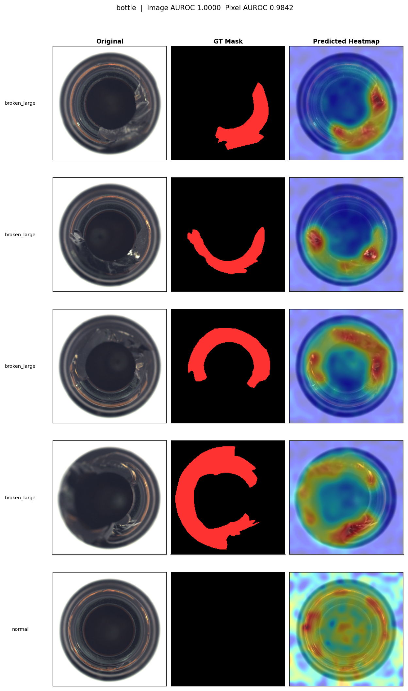
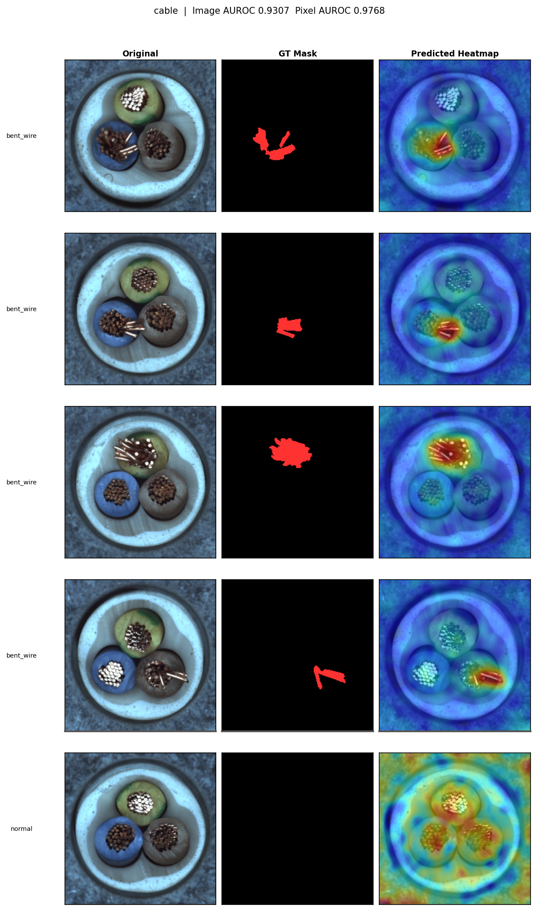
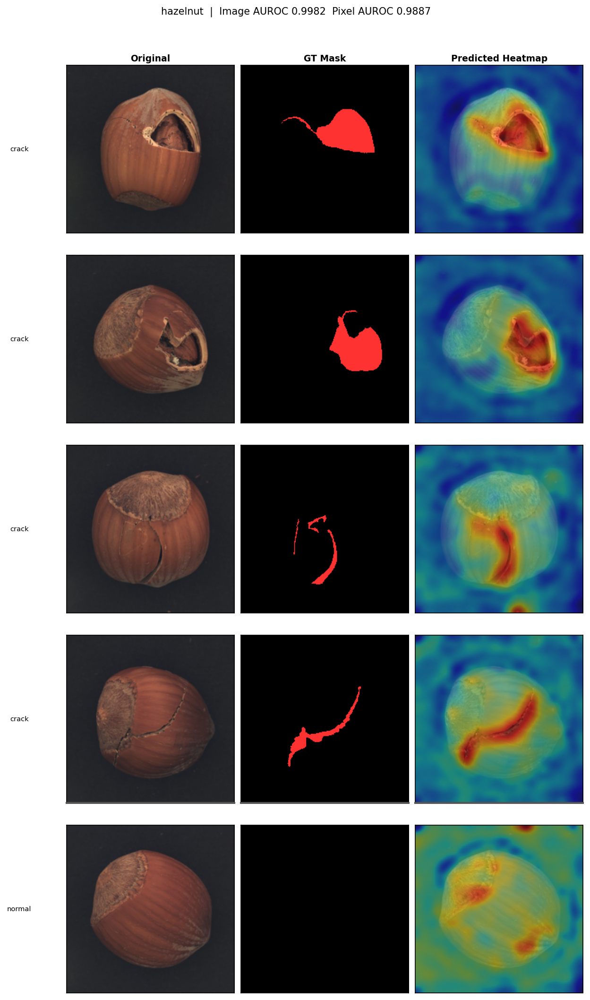
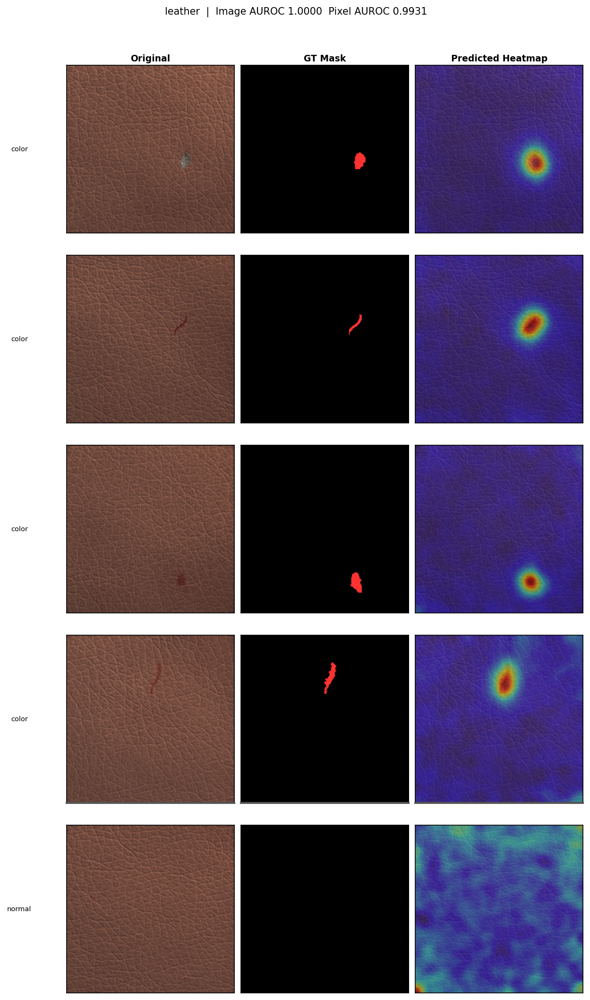
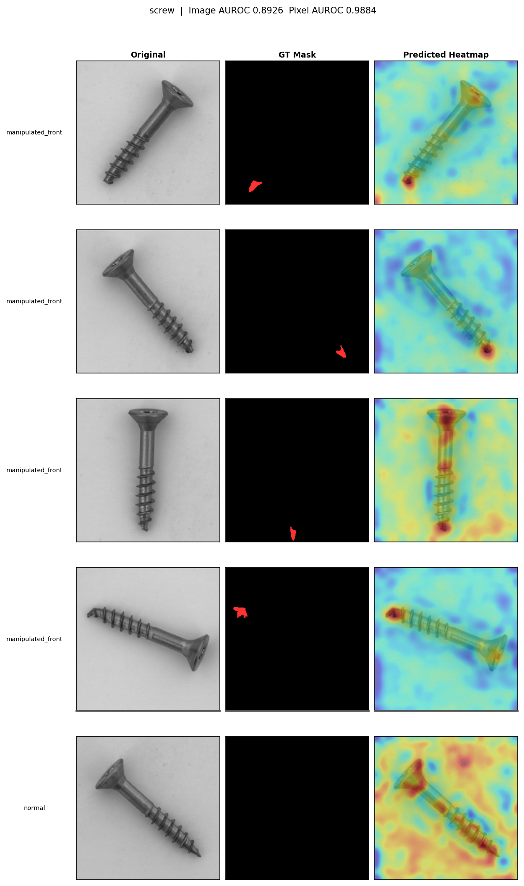

# Unsupervised Industrial Anomaly Detection on MVTec AD


End-to-end one-class anomaly detection pipeline for industrial defect detection — benchmarked on **MVTec AD**, the standard research dataset for this problem. Implements **PatchCore** (Roth et al., CVPR 2022) as the primary method and a **convolutional autoencoder** as a reconstruction-based baseline, with pixel-precise anomaly heatmaps and per-category AUROC evaluation.

---

## Motivation

Industrial inspection systems face a constraint that makes standard classification impractical: **defects are rare, heterogeneous, and often unknown in advance**. You can collect thousands of images of conforming parts; you cannot anticipate every failure mode. This makes anomaly detection a one-class learning problem by nature — define what *normal* looks like, flag everything else.

This constraint is especially pronounced in **non-destructive testing (NDT) and X-ray inspection** of metals and structural components, where defect samples (pitting, cracking, porosity, corrosion) are expensive to produce and labelling at scale is impractical. The correct formulation is identical to the MVTec AD problem: train exclusively on defect-free reference images, then detect and localise deviations at test time.

This project benchmarks two fundamentally different approaches to that problem — a pretrained-feature method and a reconstruction-based baseline — to characterise where each approach succeeds and where it breaks down. See the [results walkthrough notebook](notebooks/results_walkthrough.ipynb) for extended methodology discussion, including a detailed treatment of adapting this pipeline to NDT/X-ray inspection.

---

## Results

### PatchCore (Primary Method)

| Category | Image AUROC | Pixel AUROC |
|:---------|------------:|------------:|
| Bottle | 1.0000 | 0.9842 |
| Cable | 0.9307 | 0.9768 |
| Hazelnut | 0.9982 | 0.9887 |
| Leather | 1.0000 | 0.9931 |
| Screw | 0.8926 | 0.9884 |
| **Mean** | **0.9643** | **0.9862** |

### Autoencoder Baseline

| Category | Image AUROC | Pixel AUROC |
|:---------|------------:|------------:|
| Bottle | 0.8825 | 0.8164 |
| Cable | 0.4481 | 0.6983 |
| Hazelnut | 0.9718 | 0.9831 |
| Leather | 0.9253 | 0.9794 |
| Screw | 0.8455 | 0.9706 |
| **Mean** | **0.8146** | **0.8896** |

### Head-to-Head

| Category | PC Image | PC Pixel | AE Image | AE Pixel |
|:---------|----------:|---------:|----------:|--------:|
| Bottle | 1.0000 | 0.9842 | 0.8825 | 0.8164 |
| Cable | 0.9307 | 0.9768 | 0.4481 | 0.6983 |
| Hazelnut | 0.9982 | 0.9887 | 0.9718 | 0.9831 |
| Leather | 1.0000 | 0.9931 | 0.9253 | 0.9794 |
| Screw | 0.8926 | 0.9884 | 0.8455 | 0.9706 |
| **Mean** | **0.9643** | **0.9862** | **0.8146** | **0.8896** |

PatchCore outperforms the autoencoder across all five categories. The gap is largest on **cable** (Δ image AUROC = 0.48) — a deformable, multi-component object with high intra-class visual variance that causes the autoencoder's reconstruction prior to invert. On texture-dominant categories (hazelnut, leather), the gap narrows substantially, reflecting that consistent texture is tractable for reconstruction-based methods.

---

## Anomaly Maps

Sample output for the **bottle** category (PatchCore). Columns: Original | Ground Truth Mask | Predicted Anomaly Heatmap.



<details>
<summary>Additional categories</summary>

**Cable**



**Hazelnut**



**Leather**



**Screw**



</details>

*Figures are generated by running the benchmark script and saved to `results/figures/`.*

---

## Methods

### PatchCore

**Paper:** Roth, K. et al. *Towards Total Recall in Industrial Anomaly Detection.* CVPR 2022. [[arXiv]](https://arxiv.org/abs/2106.08265)

PatchCore requires no gradient updates. The memory bank is constructed in a single forward pass through the defect-free training set.

```
fit()
  ┌──────────────────┐     ┌──────────────────┐     ┌──────────────────┐
  │  Normal images   │ ──> │  WideResNet-50   │ ──> │  Patch embeddings│
  │  (train only)    │     │  layer2 + layer3 │     │  N × 1536-d      │
  └──────────────────┘     └──────────────────┘     └────────┬─────────┘
                                                             │ greedy coreset (1%)
                                                    ┌────────▼─────────┐
                                                    │  Memory bank     │
                                                    │  FAISS IndexL2   │
                                                    └──────────────────┘

predict()
  ┌──────────────────┐     ┌──────────────────┐     ┌──────────────────┐
  │  Test image      │ ──> │  WideResNet-50   │ ──> │  k-NN distances  │
  │  (3 × H × W)     │     │  layer2 + layer3 │     │  per patch       │
  └──────────────────┘     └──────────────────┘     └────────┬─────────┘
                                                             │ upsample + Gaussian blur
                                                    ┌────────▼─────────┐
                                                    │  Anomaly heatmap │
                                                    │  H × W           │
                                                    └──────────────────┘
```

**Key design choices:**

- **Backbone:** WideResNet-50 pretrained on ImageNet. Features from `layer2` (512-d) and `layer3` (1024-d) are concatenated to produce 1536-d patch embeddings, capturing both mid-level texture and higher-level structural features.
- **Coreset subsampling:** Greedy furthest-point sampling reduces the ~150k-patch memory bank to 1% of its original size. This minimises the maximum distance from any training patch to its nearest representative while keeping inference fast.
- **Scoring:** Each test patch is scored by its L2 distance to its nearest neighbour in the memory bank. Scores are spatially upsampled and Gaussian-smoothed (σ=4) to produce the final heatmap.

### Convolutional Autoencoder (Baseline)

A symmetric encoder-decoder trained end-to-end on defect-free images using MSE reconstruction loss. The anomaly heatmap is the per-pixel squared reconstruction error.

```
Encoder: (3,224,224) → (64,112,112) → (128,56,56) → (256,28,28) → (512,14,14) → (512,7,7) ← bottleneck

Decoder: (512,7,7) → (512,14,14) → (256,28,28) → (128,56,56) → (64,112,112) → (3,224,224)
```

Training uses Adam (lr=2×10⁻⁴), cosine annealing, and early stopping (patience=20) on a 90/10 train/validation split. ~12M parameters.

**Why include a baseline?** The comparison demonstrates concretely why the field moved from reconstruction-based methods to pretrained-feature methods. The autoencoder's performance tracks directly with intra-class visual variance: it performs well on texture-consistent categories and catastrophically on high-variance structural ones. PatchCore is robust to both.

---

## Dataset

**MVTec Anomaly Detection** (Bergmann et al., CVPR 2019) — 15 industrial categories, defect-free training sets, and pixel-precise ground truth masks for test anomalies. The standard benchmark for unsupervised industrial anomaly detection.

This project benchmarks five categories chosen to span a range of visual structure and difficulty:

| Category | Type | Defect types | Train images |
|:---------|:-----|:-------------|-------------:|
| Bottle | Rigid object | Broken large/small, contamination | 209 |
| Cable | Deformable multi-component | Missing cable, bent, cut, poked | 224 |
| Hazelnut | Organic texture | Crack, cut, hole, print | 391 |
| Leather | Flat texture | Color, cut, fold, glue, poke | 245 |
| Screw | Fine-grained rigid | Manipulated front, scratch, thread | 320 |

License: CC BY-NC-SA 4.0 (non-commercial use). See [MVTec website](https://www.mvtec.com/company/research/datasets/mvtec-ad) for download.

---

## Project Structure

```
anomaly-detection-mvtec/
│
├── configs/
│   ├── patchcore.yaml          # PatchCore hyperparameters
│   └── autoencoder.yaml        # Autoencoder hyperparameters
│
├── data/mvtec/                 # Dataset root (gitignored — see Setup)
│
├── notebooks/
│   └── results_walkthrough.ipynb   # Full results, figures, and methodology discussion
│
├── scripts/
│   ├── download_data.py        # Dataset download and extraction
│   ├── run_benchmark.py        # PatchCore benchmark sweep (all 5 categories)
│   ├── train_patchcore.py      # Fit PatchCore on a single category
│   └── train_autoencoder.py    # Train and evaluate autoencoder baseline
│
├── src/anomaly_det/
│   ├── data/
│   │   ├── mvtec.py            # MVTecDataset — PyTorch Dataset class
│   │   └── transforms.py       # Train, test, and mask transforms
│   ├── models/
│   │   ├── patchcore.py        # PatchCore model
│   │   └── autoencoder.py      # Convolutional autoencoder
│   ├── evaluation/
│   │   ├── metrics.py          # AUROC computation, EvalResult dataclass
│   │   └── visualize.py        # Heatmap overlays, result figures
│   └── pipelines/
│       ├── fit.py              # fit_category() — cached PatchCore fitting
│       ├── evaluate.py         # eval_category() — inference + metrics + figures
│       └── benchmark.py        # run_benchmark() — full category sweep
│
├── tests/
│   ├── test_dataset.py         # MVTecDataset and transform tests
│   └── test_scoring.py         # Scoring pipeline unit tests
│
├── results/                    # Generated outputs (gitignored)
│   ├── checkpoints/            # PatchCore FAISS indices
│   ├── checkpoints_ae/         # Autoencoder weights
│   ├── figures/                # PatchCore comparison figures and histograms
│   ├── figures_ae/             # Autoencoder comparison figures
│   └── metrics/                # JSON benchmark results
│
├── environment.yml
└── pyproject.toml
```

---

## Setup

**Requirements:** NVIDIA GPU recommended (tested on RTX 4060). CPU inference works but is slower for the PatchCore memory bank build step.

```bash
# 1. Create and activate the conda environment
conda env create -f environment.yml
conda activate anomaly-det

# 2. Install the package in editable mode
pip install -e . --no-deps

# 3. Download and extract the MVTec AD dataset (~4.9 GB)
python scripts/download_data.py
```

> **Note:** The automated download URL is intermittently unavailable. If it fails, download `mvtec_anomaly_detection.tar.xz` manually from the [MVTec website](https://www.mvtec.com/company/research/datasets/mvtec-ad), place it at `data/mvtec/mvtec_anomaly_detection.tar.xz`, and re-run with `--skip-download`.

### Verify installation

```bash
python -c "import torch; print(torch.__version__, torch.cuda.is_available())"
pytest tests/ -v
```

---

## Usage

### Run the full PatchCore benchmark

```bash
python scripts/run_benchmark.py
```

Fits and evaluates PatchCore across all five benchmark categories. Checkpoints are cached — re-running loads from disk rather than recomputing.

```bash
# Single category
python scripts/train_patchcore.py --category bottle

# Custom coreset ratio
python scripts/run_benchmark.py --coreset-ratio 0.05

# All 15 MVTec categories
python scripts/run_benchmark.py --categories all
```

### Train the autoencoder baseline

```bash
python scripts/train_autoencoder.py
```

Trains a convolutional autoencoder on each category with early stopping. Expects approximately 3–5 minutes per category on a modern GPU.

### Programmatic usage

```python
from anomaly_det.data import MVTecDataset, get_train_transform, get_test_transform, get_mask_transform
from anomaly_det.models import PatchCore
from anomaly_det.evaluation import evaluate_category
from torch.utils.data import DataLoader

# Fit
model = PatchCore(coreset_ratio=0.01)
train_dl = DataLoader(MVTecDataset("data/mvtec", "bottle", "train",
                      transform=get_train_transform()), batch_size=32)
model.fit(train_dl)

# Evaluate
test_ds = MVTecDataset("data/mvtec", "bottle", "test",
                       transform=get_test_transform(),
                       mask_transform=get_mask_transform())
result = evaluate_category(model, DataLoader(test_ds, batch_size=32), "bottle")
print(result.summary())

# Single image inference
score, heatmap = model.predict(test_ds[0]["image"])
# score   : float       — image-level anomaly score
# heatmap : (1, H, W)  — pixel-level anomaly map
```

---

## References

Bergmann, P., Fauser, M., Sattlegger, D., & Steger, C. (2019). **MVTec AD — A Comprehensive Real-World Dataset for Unsupervised Anomaly Detection.** *IEEE/CVF CVPR.* https://doi.org/10.1109/CVPR.2019.00982

Roth, K., Pemula, L., Zepeda, J., Schölkopf, B., Brox, T., & Gehler, P. (2022). **Towards Total Recall in Industrial Anomaly Detection.** *IEEE/CVF CVPR.* https://arxiv.org/abs/2106.08265

---

## Author

**slamwise** — [GitHub](https://github.com/slam-wise)

---

## License

This project is released under the [MIT License](LICENSE). Note that the MVTec AD dataset is licensed separately under [CC BY-NC-SA 4.0](https://creativecommons.org/licenses/by-nc-sa/4.0/) and is restricted to non-commercial use.
